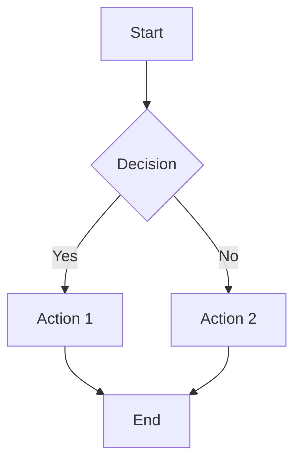

# markMaidViewer - a solution to render Markdown with embedded Mermaid diagrams

The idea is to read the markdown file and embed it into a html page that uses two existing javascript libraries to render the markdown and the mermaid diagrams.

I do this on an IBM i server with PHP.

## Javascripts used

This viewer uses two powerful JavaScript libraries:

- **[Marked.js](https://marked.js.org/)** - A fast markdown parser and compiler
- **[Mermaid.js](https://mermaid.js.org/)** - A JavaScript-based diagramming and charting tool

## Features

- Renders standard Markdown syntax (headings, lists, tables, links, etc.)
- Supports embedded Mermaid diagrams for flowcharts, sequence diagrams, and more
- Properly handles code fences with language specifications
- Automatic syntax highlighting for code blocks
- Dark/light mode support using CSS `color-scheme`
- Responsive design with clean, readable styling
- HTML entity escaping for code blocks (except Mermaid)
- Custom link processing for project-specific URLs

## Usage

### Basic Usage

Access the viewer by passing the markdown file path as a URL parameter:

```php
http://your-server/markMaidViewer.php?md=path/to/your/file.md
```

### Example

```php
http://localhost/markMaidViewer.php?md=../docs/documentation.md
```

## How It Works

### Code Fence Processing

The improved version properly detects opening and closing code fences:

1. **Opening fence**: ````language` - Starts a code block with optional language specification
2. **Closing fence**: ````` - Ends the current code block

The parser tracks whether it's inside a code block and applies appropriate HTML tags:

- ````mermaid` → `<pre class="mermaid">` (for Mermaid diagrams)
- ````javascript`, ````php`, ````sql`, etc. → `<pre class="code">` (for syntax-highlighted code)
- Generic code blocks → `<pre class="code">`

### Supported Languages

The viewer recognizes these language identifiers for code blocks:

- `html`, `javascript`, `css`, `php`
- `sql`, `rpgle`
- `json`, `xml`
- `bash`, `shell`
- `python`, `java`, `c`, `cpp`, `csharp`, `typescript`
- `mermaid` (for diagrams)

### HTML Entity Escaping

Code blocks (except Mermaid) automatically escape HTML entities to prevent rendering issues:

- `<` becomes `<`
- `>` becomes `>`
- `&` becomes `&`
- Quotes are properly escaped

This ensures code examples display correctly without being interpreted as HTML.

## Configuration

### Environment Variables

- `BASEURL` - Optional base URL for custom link processing (IBM i specific)

### Custom Link Processing

If `BASEURL` is set, the viewer processes project-specific links:

- `(QDBFSRC/` → Links to database source files
- `(QRPGSRC/` → Links to RPG source files
- File extensions (`.PF:`, `.LF:`, `.RPGLE:`, `.SQLRPGLE:`) → Converted to anchor links

## Markdown Best Practices

To ensure compatibility with markdownlint and proper rendering:

1. **Always specify language for code fences** (MD040):

   ```markdown
   ```javascript
   const x = 42;
   ```

2. **Surround code blocks with blank lines** (MD031)

3. **Use consistent heading styles** (MD003)

4. **End files with a single newline** (MD047)

See [`docs/Rules for Markdown.md`](docs/Rules%20for%20Markdown.md) for complete markdownlint rules.

## Example Markdown File

````markdown
# My Documentation

This is a paragraph with **bold** and *italic* text.

## Code Example

```javascript
function greet(name) {
    return `Hello, ${name}!`;
}
```

## Mermaid Diagram



## Table

| Column 1 | Column 2 |
|----------|----------|
| Data 1   | Data 2   |
| Data 3   | Data 4   |
````

## Technical Details

### PHP Functions

- `processCodeFences($mdfilecontents)` - Parses and converts code fences to HTML
- `processCustomLinks($content, $baseUrl)` - Handles project-specific link replacements

### JavaScript Execution Flow

1. PHP processes the markdown file and outputs HTML
2. Marked.js parses the markdown syntax
3. Mermaid.js renders diagram blocks
4. Final content is displayed in the browser

## Browser Compatibility

Works in all modern browsers that support:

- ES6 modules
- CSS `color-scheme`
- CSS `light-dark()` function

## License

This project uses open-source libraries:

- Marked.js - MIT License
- Mermaid.js - MIT License

## Contributing

When creating markdown files for this viewer:

1. Always specify language identifiers for code blocks
2. Follow markdownlint rules for consistency
3. Test with both light and dark modes
4. Ensure Mermaid diagrams use valid syntax

## Troubleshooting

### Code blocks not rendering

- Ensure code fences have proper opening (````language`) and closing (`````) markers
- Check that language identifiers are lowercase
- Verify blank lines surround code blocks

### Mermaid diagrams not displaying

- Validate Mermaid syntax at [Mermaid Live Editor](https://mermaid.live/)
- Ensure the code fence uses `mermaid` as the language identifier
- Check browser console for JavaScript errors

### File not found errors

- Verify the file path in the `md` parameter is correct
- Ensure the file is readable by the web server
- Check file permissions on the server
