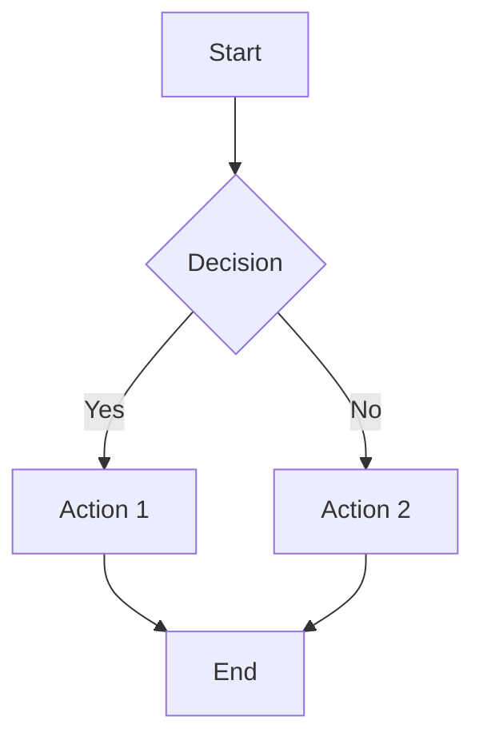

# My Documentation

This is a paragraph with **bold** and *italic* text.

## Code Example

```javascript
function greet(name) {
    return `Hello, ${name}!`;
}
```

## Mermaid Diagram



## Table

| Column 1 | Column 2 |
|----------|----------|
| Data 1   | Data 2   |
| Data 3   | Data 4   |
